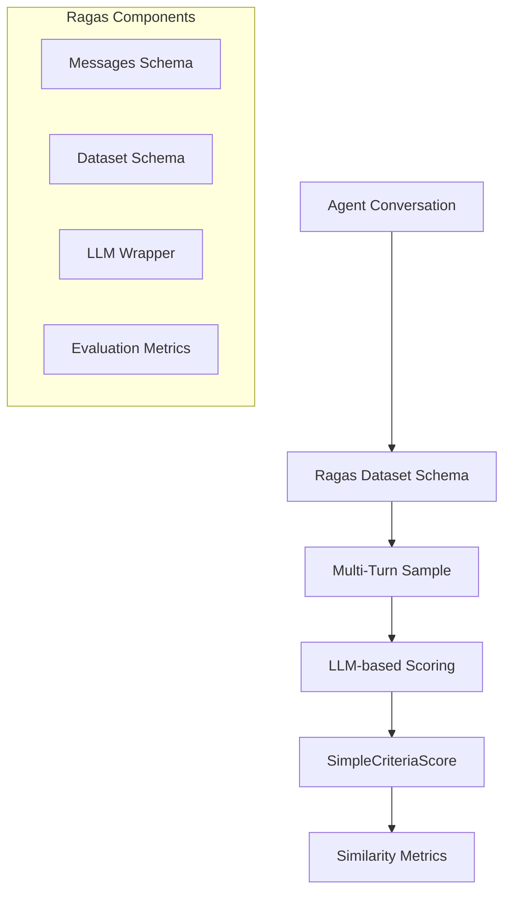
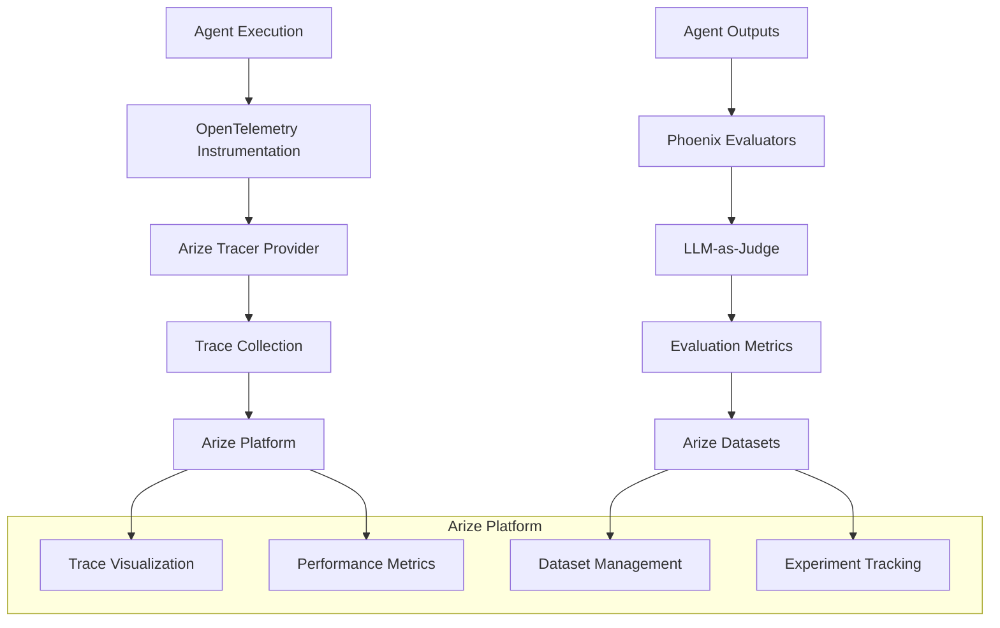

# Evaluation Frameworks Comparison: Ragas vs Arize AI

This document provides a comprehensive comparison of the two evaluation frameworks implemented in this Agent Catalog quickstart project, explaining their architectures, use cases, and integration approaches.

## Table of Contents

1. [Overview](#overview)
2. [Ragas Framework](#ragas-framework)
3. [Arize AI Framework](#arize-ai-framework)
4. [Architecture Comparison](#architecture-comparison)
5. [Integration Implementation](#integration-implementation)
6. [Use Case Recommendations](#use-case-recommendations)
7. [Getting Started](#getting-started)

## Overview

This project demonstrates comprehensive evaluation approaches across four different AI agent architectures:

**Agent Types:**
- **Flight Search Agent**: Single ReAct agent with tool calling and vector search
- **Multi-Agent Flight Planner**: LangGraph workflow with 3 specialized agents
- **Hotel Support Agent**: LangChain ReAct agent with Couchbase vector search
- **Route Planner Agent**: LlamaIndex-based agent with multiple specialized tools

**Evaluation Frameworks:**
- **Ragas**: Specialized framework for Retrieval-Augmented Generation (RAG) and conversational AI evaluation
- **Arize AI**: Production-grade observability platform with comprehensive LLM monitoring

All frameworks are integrated with the **Agent Catalog** infrastructure, providing unified tool and prompt management across different agent architectures.

## Ragas Framework

### Architecture



### Key Features

1. **Conversation-Centric Evaluation**
   - Designed specifically for multi-turn conversations
   - Handles complex dialogue flows naturally
   - Supports conversation context evaluation

2. **LLM-as-Judge Scoring**
   - Uses GPT-4 for similarity scoring (0-5 scale)
   - Evaluates responses against reference answers
   - Provides detailed scoring explanations

3. **Message Schema Integration**
   - Structured conversation representation
   - Support for Human/AI message types
   - Seamless integration with Agent Catalog spans

### Implementation Details

```python
# Ragas evaluation pipeline
ragas_input = [
    ragas.messages.HumanMessage(content=user_query),
    ragas.messages.AIMessage(content=agent_response)
]

sample = ragas.MultiTurnSample(
    user_input=ragas_input,
    reference=expected_response
)

score = ragas_scorer.multi_turn_score(sample)
```

### Strengths

- ✅ **Conversation Expertise**: Built specifically for dialogue evaluation
- ✅ **Simple Integration**: Easy to implement with existing chat systems
- ✅ **Reference Comparison**: Direct comparison with expected outputs
- ✅ **Academic Foundation**: Based on established RAG evaluation principles

### Limitations

- ⚠️ **Limited Observability**: No production monitoring capabilities
- ⚠️ **Scoring Scope**: Focused primarily on similarity metrics
- ⚠️ **No Workflow Tracking**: Limited insight into agent decision processes

## Arize AI Framework

### Architecture



### Key Features

1. **Production Observability**
   - Real-time trace monitoring
   - Performance metrics tracking
   - Latency and cost analysis
   - Error rate monitoring

2. **Comprehensive Evaluation**
   - Multiple evaluation templates (relevance, correctness, toxicity)
   - Batch evaluation capabilities
   - Custom evaluation criteria
   - Statistical analysis tools

3. **Experiment Management**
   - A/B testing capabilities
   - Configuration comparison
   - Performance trend analysis
   - Dataset versioning

4. **LLM Workflow Tracing**
   - End-to-end request tracing
   - Agent decision visualization
   - Tool usage tracking
   - Multi-agent coordination monitoring

### Implementation Details

```python
# Arize observability setup
tracer_provider = register(
    space_id=SPACE_ID,
    api_key=API_KEY,
    project_name=PROJECT_NAME,
)

# Automatic instrumentation
LangChainInstrumentor().instrument(tracer_provider=tracer_provider)
OpenAIInstrumentor().instrument(tracer_provider=tracer_provider)

# Evaluation with Phoenix
relevance_eval = llm_classify(
    dataframe=results_df,
    template=RAG_RELEVANCY_PROMPT_TEMPLATE,
    model=OpenAIModel(model="gpt-4o"),
    rails=RELEVANCE_RAILS,
    provide_explanation=True
)
```

### Strengths

- ✅ **Production Ready**: Built for enterprise-scale monitoring
- ✅ **Comprehensive Metrics**: Multiple evaluation dimensions
- ✅ **Visual Analytics**: Rich dashboard and visualization tools
- ✅ **Workflow Insights**: Deep visibility into agent decision processes
- ✅ **Experiment Tracking**: Systematic A/B testing and optimization

### Limitations

- ⚠️ **Complexity**: More complex setup and configuration
- ⚠️ **Cost**: Commercial platform with usage-based pricing
- ⚠️ **Learning Curve**: Requires understanding of observability concepts

## Architecture Comparison

| Aspect | Ragas | Arize AI |
|--------|-------|----------|
| **Primary Focus** | Conversation quality scoring | Production observability |
| **Evaluation Scope** | Response similarity & quality | Multi-dimensional metrics |
| **Observability** | Limited span logging | Full request tracing |
| **Experiment Tracking** | Basic result storage | Advanced A/B testing |
| **Visualization** | Minimal (scores only) | Rich dashboards |
| **Real-time Monitoring** | No | Yes |
| **Cost Analysis** | No | Yes |
| **Multi-agent Support** | Basic | Advanced workflow tracking |
| **Production Readiness** | Development/testing | Production deployment |

## Integration Implementation

### Project Structure

```
agent-catalog-quickstart/
├── examples/flight_search_agent/
│   ├── evals/
│   │   ├── eval_short.py          # Arize implementation
│   │   └── resources/
│   └── pyproject.toml             # Arize dependencies
├── examples/hotel_support_agent/
│   ├── evals/
│   │   ├── eval_arize.py          # Arize implementation
│   │   └── resources/
│   └── pyproject.toml             # Arize dependencies
├── examples/route_planner_agent/
│   ├── evals/
│   │   ├── eval_arize.py          # Arize implementation
│   │   └── resources/
│   └── pyproject.toml             # Arize dependencies
├── agent-catalog/examples/with_langgraph/
│   ├── evals/
│   │   ├── eval_short.py          # Original Ragas implementation
│   │   ├── eval_arize.py          # New Arize implementation
│   │   └── resources/
│   └── pyproject.toml             # Both frameworks
└── run_evaluations.py            # Unified runner for all 4 agents
```

### Agent Catalog Integration

Both frameworks integrate seamlessly with Agent Catalog:

1. **Span-based Logging**
   ```python
   # Shared across both frameworks
   with agent_span.new("Evaluation") as eval_span:
       # Run evaluation
       eval_span["score"] = result_score
       eval_span["framework"] = "ragas|arize"
   ```

2. **Tool and Prompt Management**
   ```python
   # Both use Agent Catalog for consistent tool access
   catalog = agentc.Catalog()
   tools = catalog.find("tool", name="flight_search_tool")
   ```

3. **Unified State Management**
   ```python
   # Common state structure for both evaluations
   state = AgentState(
       messages=[],
       query=user_input,
       resolved=False
   )
   ```

### Multi-Agent Workflow Evaluation

#### Single Agent (Flight Search)
- **Ragas**: Not implemented (would need adaptation)
- **Arize**: Full observability with tool call tracking

#### Multi-Agent (LangGraph)
- **Ragas**: Conversation-level evaluation
- **Arize**: Workflow-level tracing with agent transitions

```python
# Multi-agent workflow tracing (Arize)
for event in graph.stream(input=state, stream_mode="updates"):
    if "front_desk_agent" in event:
        # Track agent transitions
        trace_agent_execution(event["front_desk_agent"])
    elif "endpoint_finding_agent" in event:
        # Track airport code resolution
        trace_endpoint_resolution(event["endpoint_finding_agent"])
```

## Use Case Recommendations

### Choose Ragas When:

1. **Conversation Quality Focus**
   - Evaluating chatbot responses
   - Testing dialogue coherence
   - Academic research on conversation quality

2. **Rapid Prototyping**
   - Quick evaluation setup needed
   - Limited infrastructure requirements
   - Development and testing phases

3. **Reference-based Evaluation**
   - Ground truth responses available
   - Similarity scoring is primary metric
   - Simple pass/fail criteria

### Choose Arize When:

1. **Production Deployment**
   - Real-time monitoring required
   - Performance optimization needed
   - Cost tracking important

2. **Complex Agent Workflows**
   - Multi-agent systems
   - Tool usage analysis
   - Workflow optimization

3. **Comprehensive Analytics**
   - A/B testing requirements
   - Statistical analysis needed
   - Business metric correlation

4. **Enterprise Requirements**
   - Compliance and auditing
   - Scalable monitoring
   - Team collaboration features

### Use Both When:

1. **Comprehensive Evaluation Strategy**
   - Development: Ragas for conversation quality
   - Production: Arize for operational monitoring

2. **Validation and Verification**
   - Cross-validate evaluation results
   - Compare scoring methodologies
   - Ensure evaluation robustness

## Getting Started

### Prerequisites

```bash
# Install dependencies
pip install arize-phoenix[evals] arize-otel openinference-instrumentation-langchain
pip install ragas langchain-openai
```

### Environment Setup

```bash
# Required for both frameworks
export OPENAI_API_KEY="your-openai-key"

# Required for Arize
export ARIZE_SPACE_ID="your-space-id"
export ARIZE_API_KEY="your-api-key"
export ARIZE_DEVELOPER_KEY="your-developer-key"
```

### Running Evaluations

```bash
# Run unified evaluation script
python run_evaluations.py --help

# Individual agents
python run_evaluations.py --project flight_search --framework arize
python run_evaluations.py --project hotel_support --framework arize
python run_evaluations.py --project route_planner --framework arize
python run_evaluations.py --project with_langgraph --framework ragas

# All agents with Arize
python run_evaluations.py --project all --framework arize

# Comprehensive comparative analysis (all agents, all frameworks)
python run_evaluations.py --project all --framework both --comparison
```

### Individual Framework Usage

#### Ragas Evaluation
```bash
cd agent-catalog/examples/with_langgraph
python -m pytest evals/eval_short.py -v
```

#### Arize Evaluation
```bash
# Flight Search Agent
cd examples/flight_search_agent
python evals/eval_short.py comprehensive

# Hotel Support Agent
cd examples/hotel_support_agent
python evals/eval_arize.py comprehensive

# Route Planner Agent
cd examples/route_planner_agent
python evals/eval_arize.py comprehensive

# Multi-Agent Flight Planner
cd agent-catalog/examples/with_langgraph
python evals/eval_arize.py comprehensive
```

## Conclusion

This comprehensive evaluation framework demonstrates how to effectively monitor and optimize four different AI agent architectures:

**Agent Architecture Coverage:**
- **Single ReAct Agents** (Flight Search, Hotel Support): Traditional tool-calling patterns with vector search
- **Multi-Agent Systems** (LangGraph Flight Planner): Complex workflows with agent coordination
- **Framework Diversity** (LlamaIndex Route Planner): Different underlying AI frameworks

**Evaluation Framework Benefits:**
- **Ragas** excels at conversation-specific evaluation during development
- **Arize** provides comprehensive production monitoring and optimization across all agent types

**Key Achievements:**
1. **Unified Evaluation Strategy**: Single command to evaluate all 4 agent types
2. **Framework Comparison**: Direct performance comparison between Ragas and Arize
3. **Production Readiness**: Real-time monitoring capabilities for all architectures
4. **Scalable Patterns**: Reusable evaluation templates for new agent types

The integrated implementation demonstrates how to leverage both frameworks effectively within the Agent Catalog ecosystem, providing a complete evaluation strategy from development through production deployment across diverse agent architectures.

For optimal results:
- **Development Phase**: Use Ragas for conversation quality assurance
- **Production Phase**: Use Arize for continuous monitoring and optimization
- **Cross-Architecture**: Apply consistent evaluation patterns regardless of underlying framework